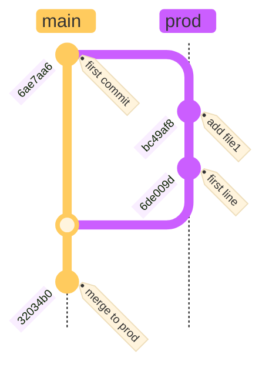

## **Branches management** ##
To list all branches, local and remotes use `git branch -a`. We can see we have one local **main** and one remote **main** repositories.
```py
$ git branch -a
* main
  remotes/origin/main
```
To create a new branch, use `git branch <branch_name>` or `git checkout -b <branch_name` to create a branch and switch to the newly created branch.
By default, the new branch is created based on the currently selected branch. To create a new branch based on another one, run `git branch -c <based_branch> <new_branch>`.
***Note:Use `git checkout <branch>`*** to swicth from a branch to another.
```py
$ git branch dev
$ git branch -a
  dev
* main
  remotes/origin/main

$ git checkout -b prod
Switched to a new branch 'prod'
$ git branch -a
  dev
  main
* prod
  remotes/origin/main
```
To rename a branch run `git branch -M <old_name> <new_name>` or you can use `git branch -M <new_name>` if the branch you want to rename is currently selected.
```py
$ git branch -M prod production
$ git branch -a
  dev
  main
* production
  remotes/origin/main
```
To delete a branch, run `git branch -d <branch_name>`.\
***Note: The branch you want to delete should not be currently selected or you will get an error***
```py
$ git branch -a
  dev
  main
* production
  remotes/origin/main
$ git branch -d production
error: Cannot delete branch 'production' checked out at '/test'

$ git checkout main
$ git branch -d production
$ git branch -a
  dev
* main
  remotes/origin/main
```
To merge a branch to another one, run `git merge <branch_to_merge>`. Let's merge the **dev** branch to the **main** branch.\
**Note: Merging two branches copies all the commits and create a new commit.**
```py
$ git checkout prod
Switched to branch 'prod'
$ git log --oneline
6de009d (HEAD -> prod) first line
bc49af8 add file1
6ae7aa6 (main) first commit

$ git checkout main
Switched to branch 'main'
$ git log --oneline
6ae7aa6 (HEAD -> main, prod) first commit

$ git merge prod
Updating 6ae7aa6..6de009d
Fast-forward
 file1 | 1 +
 1 file changed, 1 insertion(+)
 create mode 100644 file1

$ git log --oneline
32034b0 (HEAD -> main)  merge to prod branch
6de009d (prod) first line
bc49af8 add file1
6ae7aa6 first commit
```

Instead of merging, you can rebase the changes to move all your commits from the branch you want to merge from, to the main branch. It rewrites history by putting changes from one branch at the beginning of another, resulting in a more organized, linear project history. Use `git rebase <branch_name>` to do so.


